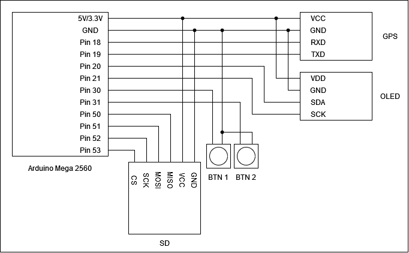

# GPS Tracker
## Description
This is a PlatformIO-based Arduino project used for recording data received from a GPS module. 
The data is saved to an SD card in the .gpx format, allowing for easy imports into other apps. 
The project also uses a display to show real-time tracking info.

## Components
This project is specifically made for the Arduino Mega 2560. With minor changes to the code, it should work on other boards as well.

- Arduino Mega 2560

- SD/Micro SD module

- GPS module (this project is built around the NEO-7M module)

- 128x64 monochrome OLED display

- Two buttons

## Wiring

## Downloaded libraries

- <a href="https://github.com/adafruit/Adafruit-GFX-Library">Adafruit GFX Library (1.11.3)<a>

- <a href="https://github.com/adafruit/Adafruit_SH110x">Adafruit SH110X (2.1.8)<a>

- <a href="https://github.com/adafruit/Adafruit_GPS">Adafruit GPS Library (1.7.2)<a>

- <a href="https://github.com/greiman/SdFat">SdFat (2.2.0)<a>

